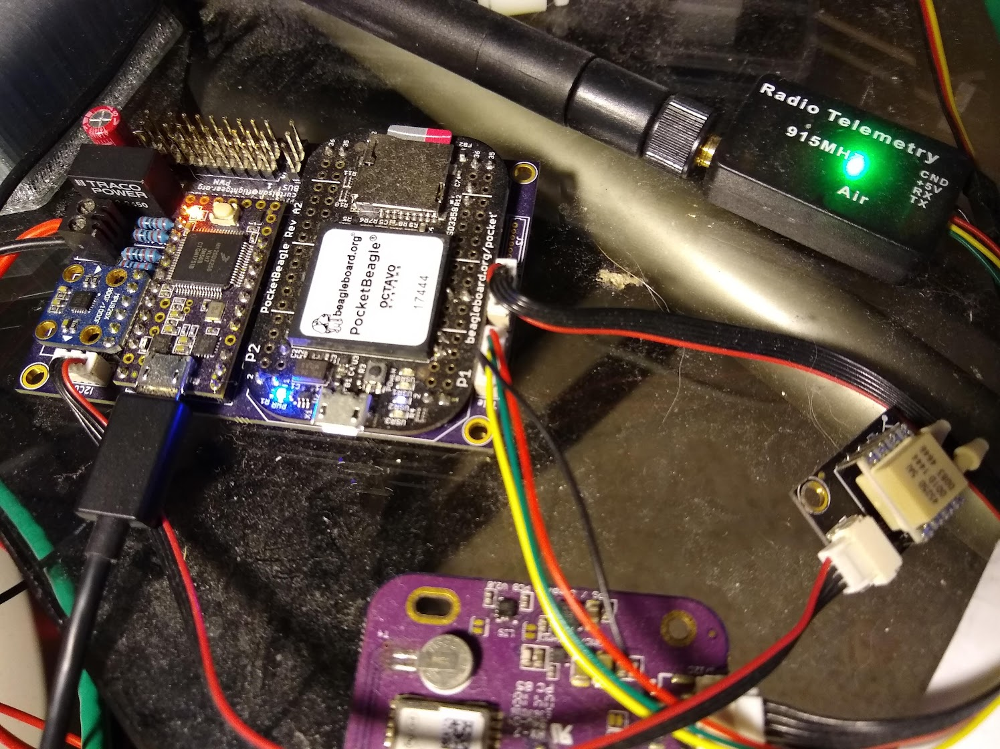

# Aura Sensors

This is an Arduino (Teensyduino) sketch for building the heart of a
UAV autopilot.  Aura-sensors turns an inexpensive teensy board into a
sensor collector, attitude determination system, communications hub,
and servo controller.  It is not yet a full fledged autopilot itself,
but designed to pair with a host linux board (such as a beaglebone or
raspberry pi) for all the higher level autopilot functions.  It
supports the mpu9250 imu, ublox8 gps, bme280/bmp280 pressure sensors,
sbus receiver, and attopilot volt/amp sensor.  It also supports an
external airdata systems via the i2c bus.

As of version 4, a high accurancy 15-state EKF has been added for
precision attitude and lcoation estimate. It is designed to work
exceptionally well for outdoor dynamic systems such as fixed wing
aircraft.

Aura Sensors is one component of a research grade autopilot system
that anyone can assemble with basic soldering skills.  Altogether,
AuraUAS is a high quality autopilot system that ephasizes high
reliability and simple code.  It offers many advanced capabilities at
a very inexpensive price point.

# Features/support

* MPU9250 via spi or i2c.
* MPU9250 DMP, interrupt generatation, scaling
* Gyro zeroing (calibration) automatically on startup if unit is still enough.
* UBLOX8 support
* 15-State EKF (kalman filter)
* SBUS input (direct) with support for 16 channels.
* BME280/BMP280 support
* Eeprom support for saving/loading config as well as assigning a serial #.
* 8 channel PWM output support
* Onboard 3-axis stability (simple dampening) system
* "Smart reciever" capability.  Handles major mixing and modes on the
  airplane side allowing flight with a 'dumb' radio.
* i2c airdata system (BFS, mRobotics, 3dr)
* Full 2-way serial communication with any host computer enabling a 
  "big processor/little processor" architecture.  Hard real time tasks run on
  the "little" processor.  High level functions run on the big processor (like
  EKF, PID's, navigation, logging, communication, mission, etc.)

# Flight Testing

* This system originated in the late 2000's and has been evolving as
  DIY haredware has improved.  The APM2 version of the firmware flew
  at least as early as 2012.  There was an APM1 version prior to that
  and a Xbow MNAV version even earlier.  The PJRC-teensy version of
  this system has been flying since February 2018.

# What's new in 2020?

* I have pushed through quite a few code architecture and
  simplification changes.  The goal is always to make the structure
  lighter weight when possible.

* I have added support for on-board accelerometer temperature
  calibration and onboard magenetometer calibration functions.

* I have added two variants of the UMN AEM ins/gns kalman filter.

  1. A 15-state ins/gps only filter (gyros, accels, gps) that performs
     extremely well for fixed wing aircraft.

  2. A 15-state ins/gps/mag filter that supports low dynamic vehicles
     such as quad copters and rovers.  As with any magnetomter based
     attitude determination system, it is critical to have well
     calibrated mags for good performance.  I have an offline "self"
     calibration system that I am considering adapting for
     onboard/automatic calibration.

# What is next?

* I would like to look into exporting the covariance matrix from the
  onboard ekf so the host can do quality/performance monitoring or
  redflag bad peformance so the operator has early notice of a
  problem.

* I would like to investigate running inner loop PID control onboard
  the teensy (offloaded from the host.)  This would lead to an
  extremely tight inner main loop: sense -> state estimator -> pid
  control -> effector output.  The higher level navigation would
  remain on the host computer as well as other functions like logging
  and communication with the ground station.